## SignalP-6.0 - Results
### Summary of 28 predicted sequences from Other
Predictions list. Use the instruction page for more detailed description of the output page.

Download:

[JSON Summary](output.json)

[Prediction summary](prediction_results.txt)

[Processed entries fasta](processed_entries.fasta)

[Processed entries gff3](output.gff3)

### Predicted Proteins
#### WP_036690263.1@GCF_001955925.1 Peptidase_S8 [Paenibacillus sp001955925]

**Prediction:** Other

| Protein type   |   Other |   Signal Peptide (Sec/SPI) |   Lipoprotein signal peptide (Sec/SPII) |   TAT signal peptide (Tat/SPI) |   TAT Lipoprotein signal peptide (Tat/SPII) |   Pilin-like signal peptide (Sec/SPIII) |
|----------------|---------|----------------------------|-----------------------------------------|--------------------------------|---------------------------------------------|-----------------------------------------|
| Likelihood     |  0.9964 |                     0.0034 |                                  0.0001 |                              0 |                                           0 |                                       0 |
**Download: ** [PNG](output_WP_036690263_1_GCF_001955925_1_Peptidase_S8__Paenibacillus_sp001955925__plot.png) / [EPS](output_WP_036690263_1_GCF_001955925_1_Peptidase_S8__Paenibacillus_sp001955925__plot.eps) /  [Tabular](output_WP_036690263_1_GCF_001955925_1_Peptidase_S8__Paenibacillus_sp001955925__plot.txt)

 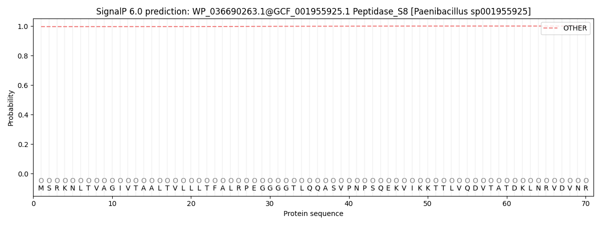 

 ***

#### WP_083677694.1@GCF_001955925.1 Peptidase_S8 [Paenibacillus sp001955925]

**Prediction:** Other

| Protein type   |   Other |   Signal Peptide (Sec/SPI) |   Lipoprotein signal peptide (Sec/SPII) |   TAT signal peptide (Tat/SPI) |   TAT Lipoprotein signal peptide (Tat/SPII) |   Pilin-like signal peptide (Sec/SPIII) |
|----------------|---------|----------------------------|-----------------------------------------|--------------------------------|---------------------------------------------|-----------------------------------------|
| Likelihood     |  0.8372 |                     0.1616 |                                  0.0005 |                         0.0004 |                                      0.0001 |                                  0.0002 |
**Download: ** [PNG](output_WP_083677694_1_GCF_001955925_1_Peptidase_S8__Paenibacillus_sp001955925__plot.png) / [EPS](output_WP_083677694_1_GCF_001955925_1_Peptidase_S8__Paenibacillus_sp001955925__plot.eps) /  [Tabular](output_WP_083677694_1_GCF_001955925_1_Peptidase_S8__Paenibacillus_sp001955925__plot.txt)

 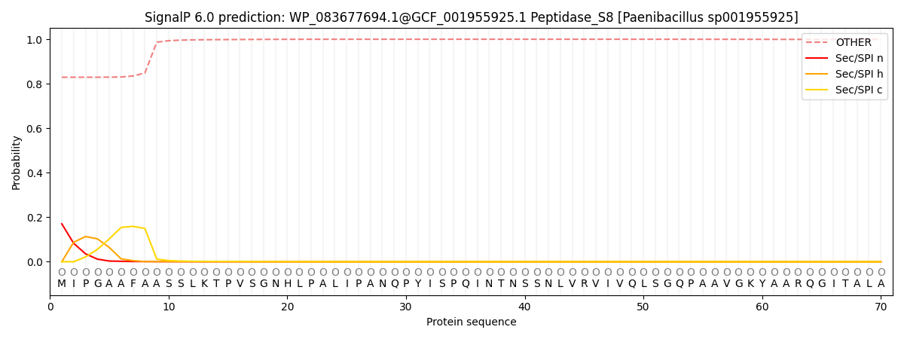 

 ***

#### WP_083678229.1@GCF_001955925.1 Peptidase_S8 [Paenibacillus sp001955925]

**Prediction:** Other

| Protein type   |   Other |   Signal Peptide (Sec/SPI) |   Lipoprotein signal peptide (Sec/SPII) |   TAT signal peptide (Tat/SPI) |   TAT Lipoprotein signal peptide (Tat/SPII) |   Pilin-like signal peptide (Sec/SPIII) |
|----------------|---------|----------------------------|-----------------------------------------|--------------------------------|---------------------------------------------|-----------------------------------------|
| Likelihood     |  1.0001 |                          0 |                                       0 |                              0 |                                           0 |                                       0 |
**Download: ** [PNG](output_WP_083678229_1_GCF_001955925_1_Peptidase_S8__Paenibacillus_sp001955925__plot.png) / [EPS](output_WP_083678229_1_GCF_001955925_1_Peptidase_S8__Paenibacillus_sp001955925__plot.eps) /  [Tabular](output_WP_083678229_1_GCF_001955925_1_Peptidase_S8__Paenibacillus_sp001955925__plot.txt)

  

 ***

#### WP_083678081.1@GCF_001955925.1 Peptidase_S8 [Paenibacillus sp001955925]

**Prediction:** Other

| Protein type   |   Other |   Signal Peptide (Sec/SPI) |   Lipoprotein signal peptide (Sec/SPII) |   TAT signal peptide (Tat/SPI) |   TAT Lipoprotein signal peptide (Tat/SPII) |   Pilin-like signal peptide (Sec/SPIII) |
|----------------|---------|----------------------------|-----------------------------------------|--------------------------------|---------------------------------------------|-----------------------------------------|
| Likelihood     |       1 |                          0 |                                       0 |                              0 |                                           0 |                                       0 |
**Download: ** [PNG](output_WP_083678081_1_GCF_001955925_1_Peptidase_S8__Paenibacillus_sp001955925__plot.png) / [EPS](output_WP_083678081_1_GCF_001955925_1_Peptidase_S8__Paenibacillus_sp001955925__plot.eps) /  [Tabular](output_WP_083678081_1_GCF_001955925_1_Peptidase_S8__Paenibacillus_sp001955925__plot.txt)

 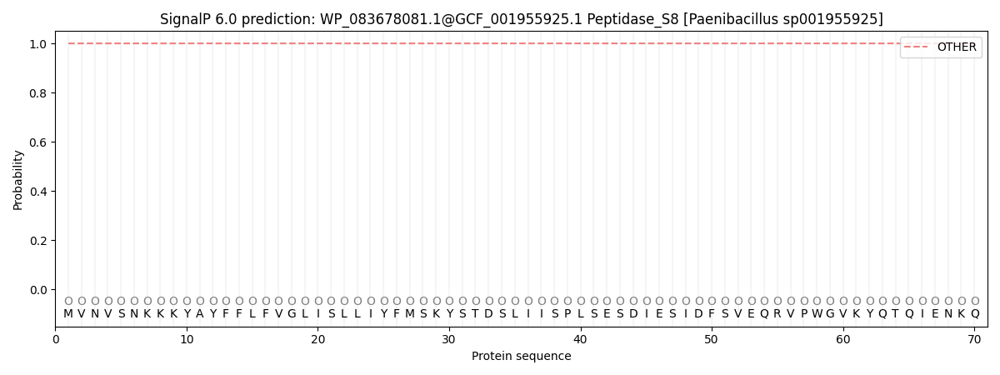 

 ***

#### WP_076154833.1@GCF_001955925.1 Peptidase_S8 [Paenibacillus sp001955925]

**Prediction:** Other

| Protein type   |   Other |   Signal Peptide (Sec/SPI) |   Lipoprotein signal peptide (Sec/SPII) |   TAT signal peptide (Tat/SPI) |   TAT Lipoprotein signal peptide (Tat/SPII) |   Pilin-like signal peptide (Sec/SPIII) |
|----------------|---------|----------------------------|-----------------------------------------|--------------------------------|---------------------------------------------|-----------------------------------------|
| Likelihood     |  1.0001 |                          0 |                                       0 |                              0 |                                           0 |                                       0 |
**Download: ** [PNG](output_WP_076154833_1_GCF_001955925_1_Peptidase_S8__Paenibacillus_sp001955925__plot.png) / [EPS](output_WP_076154833_1_GCF_001955925_1_Peptidase_S8__Paenibacillus_sp001955925__plot.eps) /  [Tabular](output_WP_076154833_1_GCF_001955925_1_Peptidase_S8__Paenibacillus_sp001955925__plot.txt)

 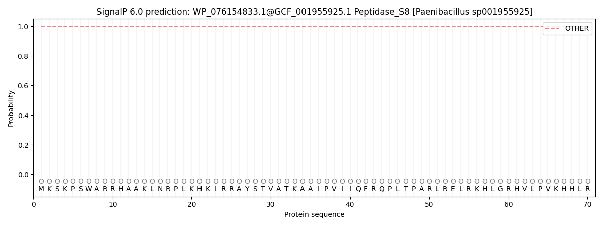 

 ***

#### WP_076156704.1@GCF_001955925.1 Peptidase_S8 [Paenibacillus sp001955925]

**Prediction:** Other

| Protein type   |   Other |   Signal Peptide (Sec/SPI) |   Lipoprotein signal peptide (Sec/SPII) |   TAT signal peptide (Tat/SPI) |   TAT Lipoprotein signal peptide (Tat/SPII) |   Pilin-like signal peptide (Sec/SPIII) |
|----------------|---------|----------------------------|-----------------------------------------|--------------------------------|---------------------------------------------|-----------------------------------------|
| Likelihood     |  1.0001 |                          0 |                                       0 |                              0 |                                           0 |                                       0 |
**Download: ** [PNG](output_WP_076156704_1_GCF_001955925_1_Peptidase_S8__Paenibacillus_sp001955925__plot.png) / [EPS](output_WP_076156704_1_GCF_001955925_1_Peptidase_S8__Paenibacillus_sp001955925__plot.eps) /  [Tabular](output_WP_076156704_1_GCF_001955925_1_Peptidase_S8__Paenibacillus_sp001955925__plot.txt)

 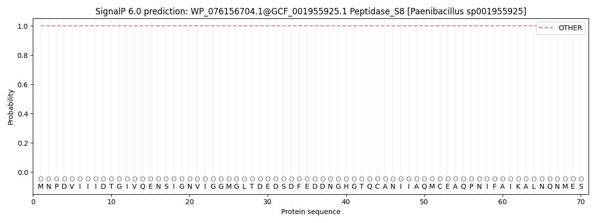 

 ***

#### WP_123062554.1@GCF_003719335.1 Peptidase_S8 [Paenibacillus amylolyticus D]

**Prediction:** Other

| Protein type   |   Other |   Signal Peptide (Sec/SPI) |   Lipoprotein signal peptide (Sec/SPII) |   TAT signal peptide (Tat/SPI) |   TAT Lipoprotein signal peptide (Tat/SPII) |   Pilin-like signal peptide (Sec/SPIII) |
|----------------|---------|----------------------------|-----------------------------------------|--------------------------------|---------------------------------------------|-----------------------------------------|
| Likelihood     |    0.99 |                     0.0097 |                                  0.0002 |                              0 |                                           0 |                                  0.0001 |
**Download: ** [PNG](output_WP_123062554_1_GCF_003719335_1_Peptidase_S8__Paenibacillus_amylolyticus_D__plot.png) / [EPS](output_WP_123062554_1_GCF_003719335_1_Peptidase_S8__Paenibacillus_amylolyticus_D__plot.eps) /  [Tabular](output_WP_123062554_1_GCF_003719335_1_Peptidase_S8__Paenibacillus_amylolyticus_D__plot.txt)

 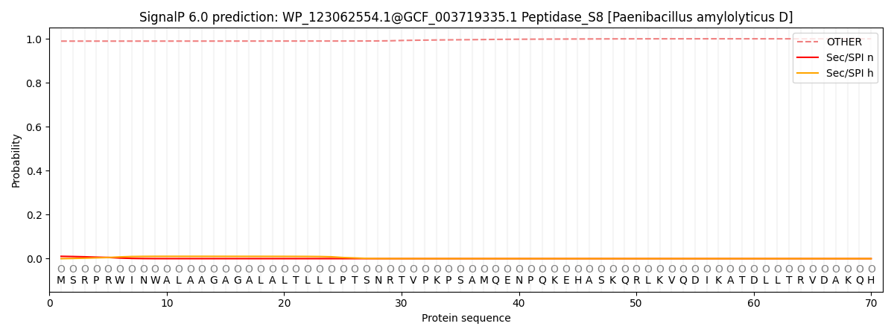 

 ***

#### WP_123064576.1@GCF_003719335.1 Peptidase_S8 [Paenibacillus amylolyticus D]

**Prediction:** Signal Peptide (Sec/SPI)

Cleavage site between pos. 25 and 26. Probability 0.981549

| Protein type   |   Other |   Signal Peptide (Sec/SPI) |   Lipoprotein signal peptide (Sec/SPII) |   TAT signal peptide (Tat/SPI) |   TAT Lipoprotein signal peptide (Tat/SPII) |   Pilin-like signal peptide (Sec/SPIII) |
|----------------|---------|----------------------------|-----------------------------------------|--------------------------------|---------------------------------------------|-----------------------------------------|
| Likelihood     |  0.0003 |                      0.999 |                                  0.0002 |                         0.0002 |                                      0.0002 |                                  0.0002 |
**Download: ** [PNG](output_WP_123064576_1_GCF_003719335_1_Peptidase_S8__Paenibacillus_amylolyticus_D__plot.png) / [EPS](output_WP_123064576_1_GCF_003719335_1_Peptidase_S8__Paenibacillus_amylolyticus_D__plot.eps) /  [Tabular](output_WP_123064576_1_GCF_003719335_1_Peptidase_S8__Paenibacillus_amylolyticus_D__plot.txt)

 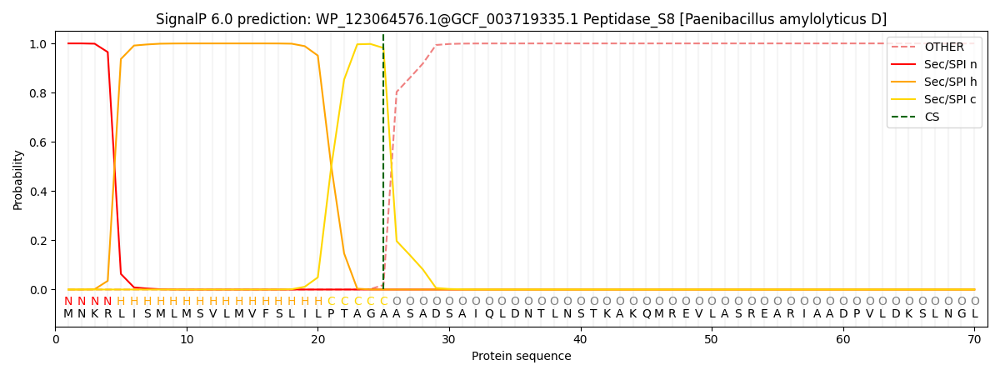 

 ***

#### WP_123067148.1@GCF_003719335.1 Peptidase_S8 [Paenibacillus amylolyticus D]

**Prediction:** Other

| Protein type   |   Other |   Signal Peptide (Sec/SPI) |   Lipoprotein signal peptide (Sec/SPII) |   TAT signal peptide (Tat/SPI) |   TAT Lipoprotein signal peptide (Tat/SPII) |   Pilin-like signal peptide (Sec/SPIII) |
|----------------|---------|----------------------------|-----------------------------------------|--------------------------------|---------------------------------------------|-----------------------------------------|
| Likelihood     |  1.0001 |                          0 |                                       0 |                              0 |                                           0 |                                       0 |
**Download: ** [PNG](output_WP_123067148_1_GCF_003719335_1_Peptidase_S8__Paenibacillus_amylolyticus_D__plot.png) / [EPS](output_WP_123067148_1_GCF_003719335_1_Peptidase_S8__Paenibacillus_amylolyticus_D__plot.eps) /  [Tabular](output_WP_123067148_1_GCF_003719335_1_Peptidase_S8__Paenibacillus_amylolyticus_D__plot.txt)

  

 ***

#### WP_123063612.1@GCF_003719335.1 Peptidase_S8 [Paenibacillus amylolyticus D]

**Prediction:** Signal Peptide (Sec/SPI)

Cleavage site between pos. 29 and 30. Probability 0.975807

| Protein type   |   Other |   Signal Peptide (Sec/SPI) |   Lipoprotein signal peptide (Sec/SPII) |   TAT signal peptide (Tat/SPI) |   TAT Lipoprotein signal peptide (Tat/SPII) |   Pilin-like signal peptide (Sec/SPIII) |
|----------------|---------|----------------------------|-----------------------------------------|--------------------------------|---------------------------------------------|-----------------------------------------|
| Likelihood     |  0.0005 |                     0.9985 |                                  0.0003 |                         0.0003 |                                      0.0002 |                                  0.0002 |
**Download: ** [PNG](output_WP_123063612_1_GCF_003719335_1_Peptidase_S8__Paenibacillus_amylolyticus_D__plot.png) / [EPS](output_WP_123063612_1_GCF_003719335_1_Peptidase_S8__Paenibacillus_amylolyticus_D__plot.eps) /  [Tabular](output_WP_123063612_1_GCF_003719335_1_Peptidase_S8__Paenibacillus_amylolyticus_D__plot.txt)

 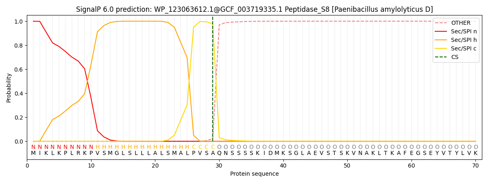 

 ***

#### WP_123065789.1@GCF_003719335.1 Peptidase_S8 [Paenibacillus amylolyticus D]

**Prediction:** Other

| Protein type   |   Other |   Signal Peptide (Sec/SPI) |   Lipoprotein signal peptide (Sec/SPII) |   TAT signal peptide (Tat/SPI) |   TAT Lipoprotein signal peptide (Tat/SPII) |   Pilin-like signal peptide (Sec/SPIII) |
|----------------|---------|----------------------------|-----------------------------------------|--------------------------------|---------------------------------------------|-----------------------------------------|
| Likelihood     |       1 |                          0 |                                       0 |                              0 |                                           0 |                                       0 |
**Download: ** [PNG](output_WP_123065789_1_GCF_003719335_1_Peptidase_S8__Paenibacillus_amylolyticus_D__plot.png) / [EPS](output_WP_123065789_1_GCF_003719335_1_Peptidase_S8__Paenibacillus_amylolyticus_D__plot.eps) /  [Tabular](output_WP_123065789_1_GCF_003719335_1_Peptidase_S8__Paenibacillus_amylolyticus_D__plot.txt)

 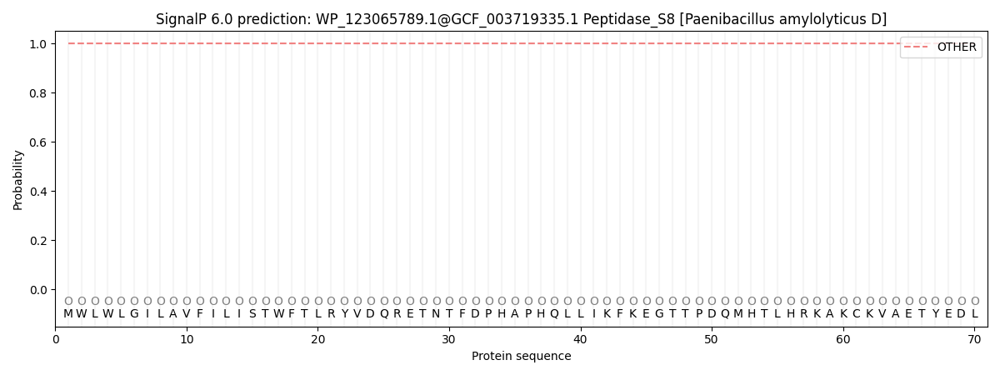 

 ***

#### WP_123062437.1@GCF_003719335.1 Peptidase_S8 [Paenibacillus amylolyticus D]

**Prediction:** Other

| Protein type   |   Other |   Signal Peptide (Sec/SPI) |   Lipoprotein signal peptide (Sec/SPII) |   TAT signal peptide (Tat/SPI) |   TAT Lipoprotein signal peptide (Tat/SPII) |   Pilin-like signal peptide (Sec/SPIII) |
|----------------|---------|----------------------------|-----------------------------------------|--------------------------------|---------------------------------------------|-----------------------------------------|
| Likelihood     |  1.0001 |                          0 |                                       0 |                              0 |                                           0 |                                       0 |
**Download: ** [PNG](output_WP_123062437_1_GCF_003719335_1_Peptidase_S8__Paenibacillus_amylolyticus_D__plot.png) / [EPS](output_WP_123062437_1_GCF_003719335_1_Peptidase_S8__Paenibacillus_amylolyticus_D__plot.eps) /  [Tabular](output_WP_123062437_1_GCF_003719335_1_Peptidase_S8__Paenibacillus_amylolyticus_D__plot.txt)

 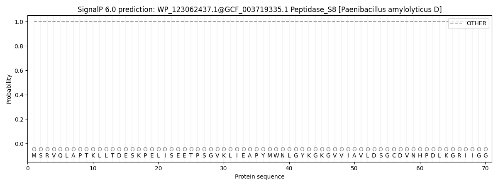 

 ***

#### WP_341466884.1@GCF_004339095.1 Peptidase_S8 [Natranaerovirga hydrolytica]

**Prediction:** Other

| Protein type   |   Other |   Signal Peptide (Sec/SPI) |   Lipoprotein signal peptide (Sec/SPII) |   TAT signal peptide (Tat/SPI) |   TAT Lipoprotein signal peptide (Tat/SPII) |   Pilin-like signal peptide (Sec/SPIII) |
|----------------|---------|----------------------------|-----------------------------------------|--------------------------------|---------------------------------------------|-----------------------------------------|
| Likelihood     |  1.0001 |                          0 |                                       0 |                              0 |                                           0 |                                       0 |
**Download: ** [PNG](output_WP_341466884_1_GCF_004339095_1_Peptidase_S8__Natranaerovirga_hydrolytica__plot.png) / [EPS](output_WP_341466884_1_GCF_004339095_1_Peptidase_S8__Natranaerovirga_hydrolytica__plot.eps) /  [Tabular](output_WP_341466884_1_GCF_004339095_1_Peptidase_S8__Natranaerovirga_hydrolytica__plot.txt)

 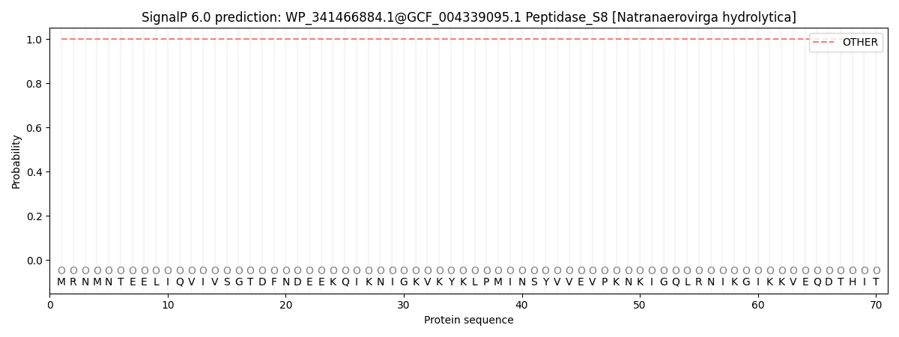 

 ***

#### WP_132282797.1@GCF_004339095.1 Peptidase_S8 [Natranaerovirga hydrolytica]

**Prediction:** Other

| Protein type   |   Other |   Signal Peptide (Sec/SPI) |   Lipoprotein signal peptide (Sec/SPII) |   TAT signal peptide (Tat/SPI) |   TAT Lipoprotein signal peptide (Tat/SPII) |   Pilin-like signal peptide (Sec/SPIII) |
|----------------|---------|----------------------------|-----------------------------------------|--------------------------------|---------------------------------------------|-----------------------------------------|
| Likelihood     |       1 |                          0 |                                       0 |                              0 |                                           0 |                                       0 |
**Download: ** [PNG](output_WP_132282797_1_GCF_004339095_1_Peptidase_S8__Natranaerovirga_hydrolytica__plot.png) / [EPS](output_WP_132282797_1_GCF_004339095_1_Peptidase_S8__Natranaerovirga_hydrolytica__plot.eps) /  [Tabular](output_WP_132282797_1_GCF_004339095_1_Peptidase_S8__Natranaerovirga_hydrolytica__plot.txt)

 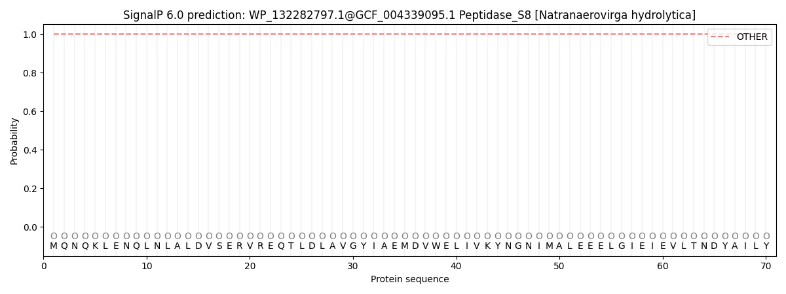 

 ***

#### WP_132279962.1@GCF_004339095.1 Peptidase_S8 [Natranaerovirga hydrolytica]

**Prediction:** Other

| Protein type   |   Other |   Signal Peptide (Sec/SPI) |   Lipoprotein signal peptide (Sec/SPII) |   TAT signal peptide (Tat/SPI) |   TAT Lipoprotein signal peptide (Tat/SPII) |   Pilin-like signal peptide (Sec/SPIII) |
|----------------|---------|----------------------------|-----------------------------------------|--------------------------------|---------------------------------------------|-----------------------------------------|
| Likelihood     |       1 |                          0 |                                       0 |                              0 |                                           0 |                                       0 |
**Download: ** [PNG](output_WP_132279962_1_GCF_004339095_1_Peptidase_S8__Natranaerovirga_hydrolytica__plot.png) / [EPS](output_WP_132279962_1_GCF_004339095_1_Peptidase_S8__Natranaerovirga_hydrolytica__plot.eps) /  [Tabular](output_WP_132279962_1_GCF_004339095_1_Peptidase_S8__Natranaerovirga_hydrolytica__plot.txt)

 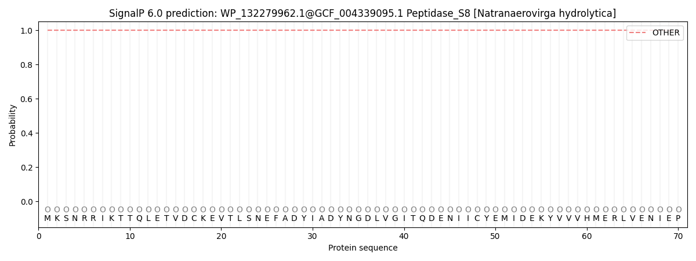 

 ***

#### WP_132281079.1@GCF_004339095.1 Peptidase_S8 [Natranaerovirga hydrolytica]

**Prediction:** Other

| Protein type   |   Other |   Signal Peptide (Sec/SPI) |   Lipoprotein signal peptide (Sec/SPII) |   TAT signal peptide (Tat/SPI) |   TAT Lipoprotein signal peptide (Tat/SPII) |   Pilin-like signal peptide (Sec/SPIII) |
|----------------|---------|----------------------------|-----------------------------------------|--------------------------------|---------------------------------------------|-----------------------------------------|
| Likelihood     |  1.0001 |                          0 |                                       0 |                              0 |                                           0 |                                       0 |
**Download: ** [PNG](output_WP_132281079_1_GCF_004339095_1_Peptidase_S8__Natranaerovirga_hydrolytica__plot.png) / [EPS](output_WP_132281079_1_GCF_004339095_1_Peptidase_S8__Natranaerovirga_hydrolytica__plot.eps) /  [Tabular](output_WP_132281079_1_GCF_004339095_1_Peptidase_S8__Natranaerovirga_hydrolytica__plot.txt)

 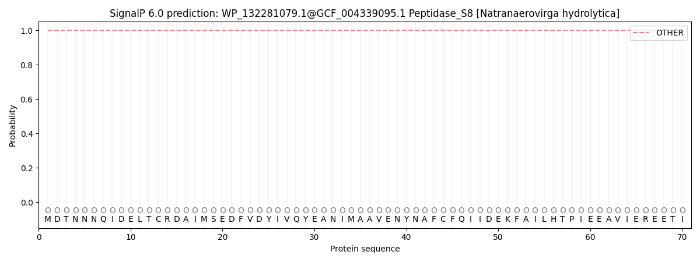 

 ***

#### WP_132281055.1@GCF_004339095.1 Peptidase_S8 [Natranaerovirga hydrolytica]

**Prediction:** Other

| Protein type   |   Other |   Signal Peptide (Sec/SPI) |   Lipoprotein signal peptide (Sec/SPII) |   TAT signal peptide (Tat/SPI) |   TAT Lipoprotein signal peptide (Tat/SPII) |   Pilin-like signal peptide (Sec/SPIII) |
|----------------|---------|----------------------------|-----------------------------------------|--------------------------------|---------------------------------------------|-----------------------------------------|
| Likelihood     |  1.0001 |                          0 |                                       0 |                              0 |                                           0 |                                       0 |
**Download: ** [PNG](output_WP_132281055_1_GCF_004339095_1_Peptidase_S8__Natranaerovirga_hydrolytica__plot.png) / [EPS](output_WP_132281055_1_GCF_004339095_1_Peptidase_S8__Natranaerovirga_hydrolytica__plot.eps) /  [Tabular](output_WP_132281055_1_GCF_004339095_1_Peptidase_S8__Natranaerovirga_hydrolytica__plot.txt)

 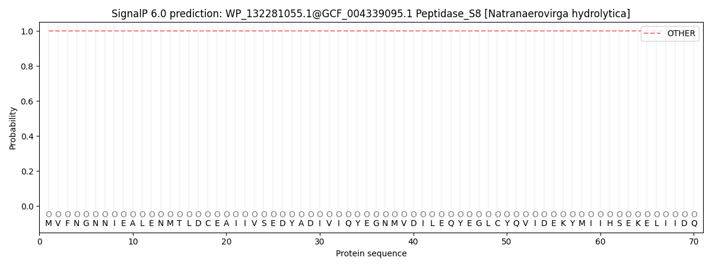 

 ***

#### WP_132281082.1@GCF_004339095.1 Peptidase_S8 [Natranaerovirga hydrolytica]

**Prediction:** Other

| Protein type   |   Other |   Signal Peptide (Sec/SPI) |   Lipoprotein signal peptide (Sec/SPII) |   TAT signal peptide (Tat/SPI) |   TAT Lipoprotein signal peptide (Tat/SPII) |   Pilin-like signal peptide (Sec/SPIII) |
|----------------|---------|----------------------------|-----------------------------------------|--------------------------------|---------------------------------------------|-----------------------------------------|
| Likelihood     |  0.9997 |                     0.0003 |                                       0 |                              0 |                                           0 |                                       0 |
**Download: ** [PNG](output_WP_132281082_1_GCF_004339095_1_Peptidase_S8__Natranaerovirga_hydrolytica__plot.png) / [EPS](output_WP_132281082_1_GCF_004339095_1_Peptidase_S8__Natranaerovirga_hydrolytica__plot.eps) /  [Tabular](output_WP_132281082_1_GCF_004339095_1_Peptidase_S8__Natranaerovirga_hydrolytica__plot.txt)

 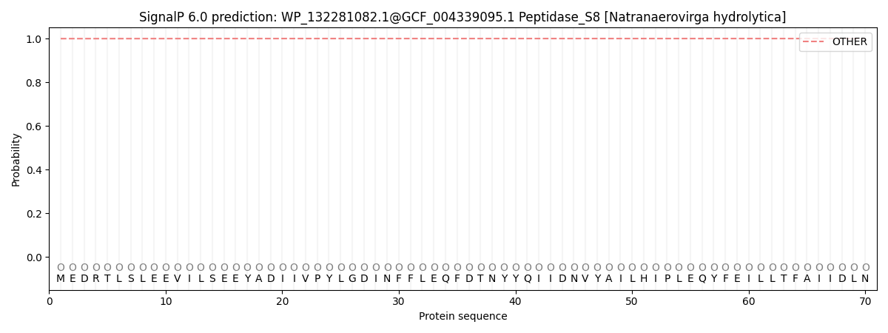 

 ***

#### WP_165868501.1@GCF_004339095.1 Peptidase_S8 [Natranaerovirga hydrolytica]

**Prediction:** Other

| Protein type   |   Other |   Signal Peptide (Sec/SPI) |   Lipoprotein signal peptide (Sec/SPII) |   TAT signal peptide (Tat/SPI) |   TAT Lipoprotein signal peptide (Tat/SPII) |   Pilin-like signal peptide (Sec/SPIII) |
|----------------|---------|----------------------------|-----------------------------------------|--------------------------------|---------------------------------------------|-----------------------------------------|
| Likelihood     |  1.0001 |                          0 |                                       0 |                              0 |                                           0 |                                       0 |
**Download: ** [PNG](output_WP_165868501_1_GCF_004339095_1_Peptidase_S8__Natranaerovirga_hydrolytica__plot.png) / [EPS](output_WP_165868501_1_GCF_004339095_1_Peptidase_S8__Natranaerovirga_hydrolytica__plot.eps) /  [Tabular](output_WP_165868501_1_GCF_004339095_1_Peptidase_S8__Natranaerovirga_hydrolytica__plot.txt)

  

 ***

#### WP_132281070.1@GCF_004339095.1 Peptidase_S8 [Natranaerovirga hydrolytica]

**Prediction:** Other

| Protein type   |   Other |   Signal Peptide (Sec/SPI) |   Lipoprotein signal peptide (Sec/SPII) |   TAT signal peptide (Tat/SPI) |   TAT Lipoprotein signal peptide (Tat/SPII) |   Pilin-like signal peptide (Sec/SPIII) |
|----------------|---------|----------------------------|-----------------------------------------|--------------------------------|---------------------------------------------|-----------------------------------------|
| Likelihood     |  0.9999 |                     0.0001 |                                       0 |                              0 |                                           0 |                                       0 |
**Download: ** [PNG](output_WP_132281070_1_GCF_004339095_1_Peptidase_S8__Natranaerovirga_hydrolytica__plot.png) / [EPS](output_WP_132281070_1_GCF_004339095_1_Peptidase_S8__Natranaerovirga_hydrolytica__plot.eps) /  [Tabular](output_WP_132281070_1_GCF_004339095_1_Peptidase_S8__Natranaerovirga_hydrolytica__plot.txt)

 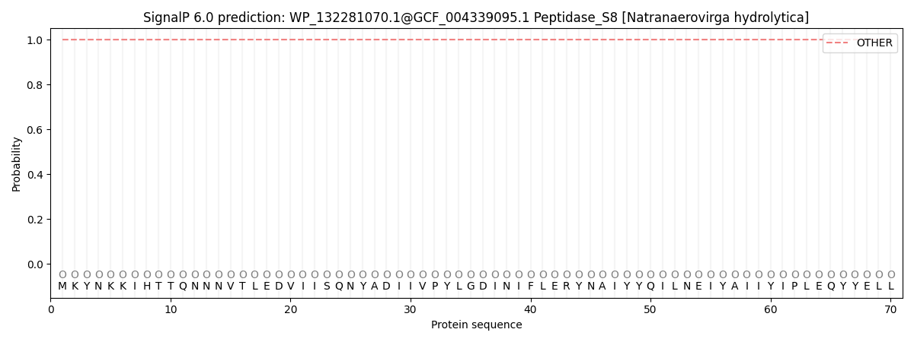 

 ***

#### WP_132279959.1@GCF_004339095.1 Peptidase_S8 [Natranaerovirga hydrolytica]

**Prediction:** Other

| Protein type   |   Other |   Signal Peptide (Sec/SPI) |   Lipoprotein signal peptide (Sec/SPII) |   TAT signal peptide (Tat/SPI) |   TAT Lipoprotein signal peptide (Tat/SPII) |   Pilin-like signal peptide (Sec/SPIII) |
|----------------|---------|----------------------------|-----------------------------------------|--------------------------------|---------------------------------------------|-----------------------------------------|
| Likelihood     |  1.0001 |                          0 |                                       0 |                              0 |                                           0 |                                       0 |
**Download: ** [PNG](output_WP_132279959_1_GCF_004339095_1_Peptidase_S8__Natranaerovirga_hydrolytica__plot.png) / [EPS](output_WP_132279959_1_GCF_004339095_1_Peptidase_S8__Natranaerovirga_hydrolytica__plot.eps) /  [Tabular](output_WP_132279959_1_GCF_004339095_1_Peptidase_S8__Natranaerovirga_hydrolytica__plot.txt)

  

 ***

#### WP_132281073.1@GCF_004339095.1 Peptidase_S8 [Natranaerovirga hydrolytica]

**Prediction:** Other

| Protein type   |   Other |   Signal Peptide (Sec/SPI) |   Lipoprotein signal peptide (Sec/SPII) |   TAT signal peptide (Tat/SPI) |   TAT Lipoprotein signal peptide (Tat/SPII) |   Pilin-like signal peptide (Sec/SPIII) |
|----------------|---------|----------------------------|-----------------------------------------|--------------------------------|---------------------------------------------|-----------------------------------------|
| Likelihood     |  0.9986 |                     0.0012 |                                  0.0001 |                              0 |                                           0 |                                       0 |
**Download: ** [PNG](output_WP_132281073_1_GCF_004339095_1_Peptidase_S8__Natranaerovirga_hydrolytica__plot.png) / [EPS](output_WP_132281073_1_GCF_004339095_1_Peptidase_S8__Natranaerovirga_hydrolytica__plot.eps) /  [Tabular](output_WP_132281073_1_GCF_004339095_1_Peptidase_S8__Natranaerovirga_hydrolytica__plot.txt)

 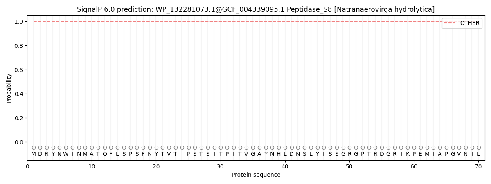 

 ***

#### WP_165868502.1@GCF_004339095.1 Peptidase_S8 [Natranaerovirga hydrolytica]

**Prediction:** Other

| Protein type   |   Other |   Signal Peptide (Sec/SPI) |   Lipoprotein signal peptide (Sec/SPII) |   TAT signal peptide (Tat/SPI) |   TAT Lipoprotein signal peptide (Tat/SPII) |   Pilin-like signal peptide (Sec/SPIII) |
|----------------|---------|----------------------------|-----------------------------------------|--------------------------------|---------------------------------------------|-----------------------------------------|
| Likelihood     |       1 |                          0 |                                       0 |                              0 |                                           0 |                                       0 |
**Download: ** [PNG](output_WP_165868502_1_GCF_004339095_1_Peptidase_S8__Natranaerovirga_hydrolytica__plot.png) / [EPS](output_WP_165868502_1_GCF_004339095_1_Peptidase_S8__Natranaerovirga_hydrolytica__plot.eps) /  [Tabular](output_WP_165868502_1_GCF_004339095_1_Peptidase_S8__Natranaerovirga_hydrolytica__plot.txt)

  

 ***

#### WP_076288104.1@GCF_013359905.1 Peptidase_S8 [Paenibacillus taichungensis]

**Prediction:** Other

| Protein type   |   Other |   Signal Peptide (Sec/SPI) |   Lipoprotein signal peptide (Sec/SPII) |   TAT signal peptide (Tat/SPI) |   TAT Lipoprotein signal peptide (Tat/SPII) |   Pilin-like signal peptide (Sec/SPIII) |
|----------------|---------|----------------------------|-----------------------------------------|--------------------------------|---------------------------------------------|-----------------------------------------|
| Likelihood     |  0.9483 |                      0.051 |                                  0.0003 |                         0.0002 |                                      0.0001 |                                  0.0001 |
**Download: ** [PNG](output_WP_076288104_1_GCF_013359905_1_Peptidase_S8__Paenibacillus_taichungensis__plot.png) / [EPS](output_WP_076288104_1_GCF_013359905_1_Peptidase_S8__Paenibacillus_taichungensis__plot.eps) /  [Tabular](output_WP_076288104_1_GCF_013359905_1_Peptidase_S8__Paenibacillus_taichungensis__plot.txt)

 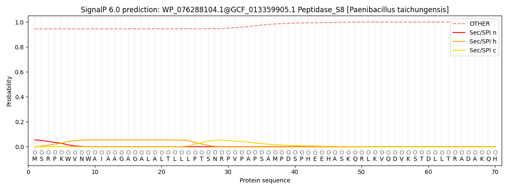 

 ***

#### WP_281364809.1@GCF_013359905.1 Peptidase_S8 [Paenibacillus taichungensis]

**Prediction:** Signal Peptide (Sec/SPI)

Cleavage site between pos. 25 and 26. Probability 0.965550

| Protein type   |   Other |   Signal Peptide (Sec/SPI) |   Lipoprotein signal peptide (Sec/SPII) |   TAT signal peptide (Tat/SPI) |   TAT Lipoprotein signal peptide (Tat/SPII) |   Pilin-like signal peptide (Sec/SPIII) |
|----------------|---------|----------------------------|-----------------------------------------|--------------------------------|---------------------------------------------|-----------------------------------------|
| Likelihood     |  0.0002 |                     0.9991 |                                  0.0002 |                         0.0002 |                                      0.0002 |                                  0.0001 |
**Download: ** [PNG](output_WP_281364809_1_GCF_013359905_1_Peptidase_S8__Paenibacillus_taichungensis__plot.png) / [EPS](output_WP_281364809_1_GCF_013359905_1_Peptidase_S8__Paenibacillus_taichungensis__plot.eps) /  [Tabular](output_WP_281364809_1_GCF_013359905_1_Peptidase_S8__Paenibacillus_taichungensis__plot.txt)

 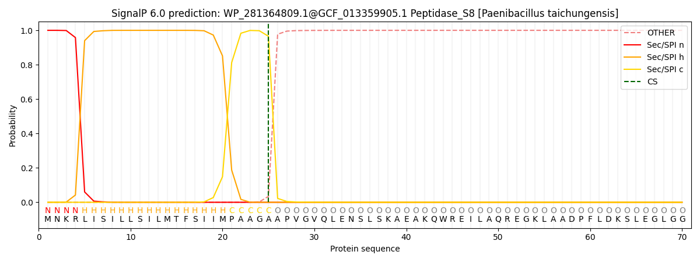 

 ***

#### WP_076292189.1@GCF_013359905.1 Peptidase_S8 [Paenibacillus taichungensis]

**Prediction:** Other

| Protein type   |   Other |   Signal Peptide (Sec/SPI) |   Lipoprotein signal peptide (Sec/SPII) |   TAT signal peptide (Tat/SPI) |   TAT Lipoprotein signal peptide (Tat/SPII) |   Pilin-like signal peptide (Sec/SPIII) |
|----------------|---------|----------------------------|-----------------------------------------|--------------------------------|---------------------------------------------|-----------------------------------------|
| Likelihood     |  1.0001 |                          0 |                                       0 |                              0 |                                           0 |                                       0 |
**Download: ** [PNG](output_WP_076292189_1_GCF_013359905_1_Peptidase_S8__Paenibacillus_taichungensis__plot.png) / [EPS](output_WP_076292189_1_GCF_013359905_1_Peptidase_S8__Paenibacillus_taichungensis__plot.eps) /  [Tabular](output_WP_076292189_1_GCF_013359905_1_Peptidase_S8__Paenibacillus_taichungensis__plot.txt)

  

 ***

#### WP_175382407.1@GCF_013359905.1 Peptidase_S8 [Paenibacillus taichungensis]

**Prediction:** Other

| Protein type   |   Other |   Signal Peptide (Sec/SPI) |   Lipoprotein signal peptide (Sec/SPII) |   TAT signal peptide (Tat/SPI) |   TAT Lipoprotein signal peptide (Tat/SPII) |   Pilin-like signal peptide (Sec/SPIII) |
|----------------|---------|----------------------------|-----------------------------------------|--------------------------------|---------------------------------------------|-----------------------------------------|
| Likelihood     |  0.9999 |                     0.0001 |                                       0 |                              0 |                                           0 |                                       0 |
**Download: ** [PNG](output_WP_175382407_1_GCF_013359905_1_Peptidase_S8__Paenibacillus_taichungensis__plot.png) / [EPS](output_WP_175382407_1_GCF_013359905_1_Peptidase_S8__Paenibacillus_taichungensis__plot.eps) /  [Tabular](output_WP_175382407_1_GCF_013359905_1_Peptidase_S8__Paenibacillus_taichungensis__plot.txt)

  

 ***

#### WP_175382701.1@GCF_013359905.1 Peptidase_S8 [Paenibacillus taichungensis]

**Prediction:** Signal Peptide (Sec/SPI)

Cleavage site between pos. 29 and 30. Probability 0.977402

| Protein type   |   Other |   Signal Peptide (Sec/SPI) |   Lipoprotein signal peptide (Sec/SPII) |   TAT signal peptide (Tat/SPI) |   TAT Lipoprotein signal peptide (Tat/SPII) |   Pilin-like signal peptide (Sec/SPIII) |
|----------------|---------|----------------------------|-----------------------------------------|--------------------------------|---------------------------------------------|-----------------------------------------|
| Likelihood     |  0.0004 |                     0.9987 |                                  0.0003 |                         0.0002 |                                      0.0002 |                                  0.0002 |
**Download: ** [PNG](output_WP_175382701_1_GCF_013359905_1_Peptidase_S8__Paenibacillus_taichungensis__plot.png) / [EPS](output_WP_175382701_1_GCF_013359905_1_Peptidase_S8__Paenibacillus_taichungensis__plot.eps) /  [Tabular](output_WP_175382701_1_GCF_013359905_1_Peptidase_S8__Paenibacillus_taichungensis__plot.txt)

 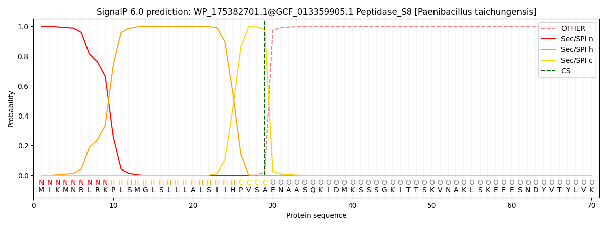 

 ***

