## SignalP-6.0 - Results
### Summary of 22 predicted sequences from Other
Predictions list. Use the instruction page for more detailed description of the output page.

Download:

[JSON Summary](output.json)

[Prediction summary](prediction_results.txt)

[Processed entries fasta](processed_entries.fasta)

[Processed entries gff3](output.gff3)

### Predicted Proteins
#### WP_014732703.1@GCF_000306765.2

**Prediction:** TAT signal peptide (Tat/SPI)

Cleavage site between pos. 37 and 38. Probability 0.904715

| Protein type   |   Other |   Signal Peptide (Sec/SPI) |   Lipoprotein signal peptide (Sec/SPII) |   TAT signal peptide (Tat/SPI) |   TAT Lipoprotein signal peptide (Tat/SPII) |   Pilin-like signal peptide (Sec/SPIII) |
|----------------|---------|----------------------------|-----------------------------------------|--------------------------------|---------------------------------------------|-----------------------------------------|
| Likelihood     |       0 |                          0 |                                       0 |                         0.9998 |                                      0.0002 |                                       0 |
**Download: ** [PNG](output_WP_014732703_1_GCF_000306765_2_plot.png) / [EPS](output_WP_014732703_1_GCF_000306765_2_plot.eps) /  [Tabular](output_WP_014732703_1_GCF_000306765_2_plot.txt)

 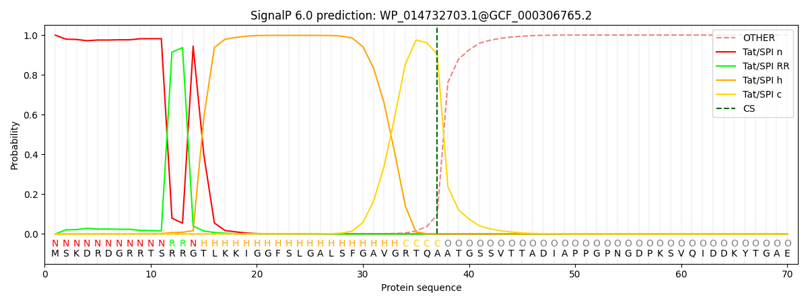 

 ***

#### WP_241433888.1@GCF_000337535.1

**Prediction:** TAT signal peptide (Tat/SPI)

Cleavage site between pos. 50 and 51. Probability 0.763965

| Protein type   |   Other |   Signal Peptide (Sec/SPI) |   Lipoprotein signal peptide (Sec/SPII) |   TAT signal peptide (Tat/SPI) |   TAT Lipoprotein signal peptide (Tat/SPII) |   Pilin-like signal peptide (Sec/SPIII) |
|----------------|---------|----------------------------|-----------------------------------------|--------------------------------|---------------------------------------------|-----------------------------------------|
| Likelihood     |  0.0001 |                     0.0003 |                                       0 |                         0.8849 |                                      0.1147 |                                       0 |
**Download: ** [PNG](output_WP_241433888_1_GCF_000337535_1_plot.png) / [EPS](output_WP_241433888_1_GCF_000337535_1_plot.eps) /  [Tabular](output_WP_241433888_1_GCF_000337535_1_plot.txt)

 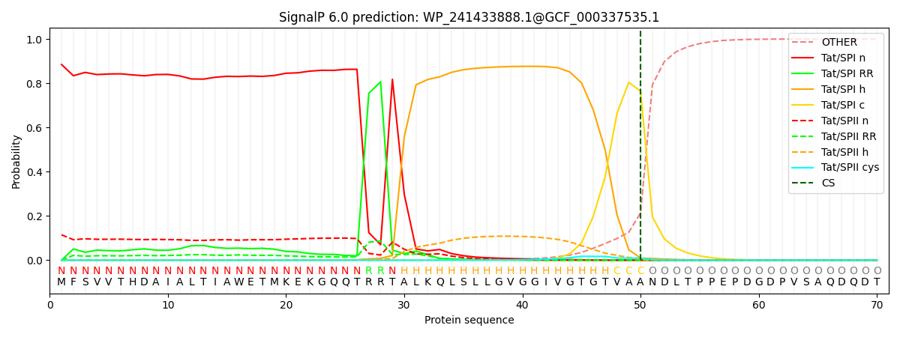 

 ***

#### WP_008458115.1@GCF_000337175.1

**Prediction:** Other

| Protein type   |   Other |   Signal Peptide (Sec/SPI) |   Lipoprotein signal peptide (Sec/SPII) |   TAT signal peptide (Tat/SPI) |   TAT Lipoprotein signal peptide (Tat/SPII) |   Pilin-like signal peptide (Sec/SPIII) |
|----------------|---------|----------------------------|-----------------------------------------|--------------------------------|---------------------------------------------|-----------------------------------------|
| Likelihood     |  1.0001 |                          0 |                                       0 |                              0 |                                           0 |                                       0 |
**Download: ** [PNG](output_WP_008458115_1_GCF_000337175_1_plot.png) / [EPS](output_WP_008458115_1_GCF_000337175_1_plot.eps) /  [Tabular](output_WP_008458115_1_GCF_000337175_1_plot.txt)

 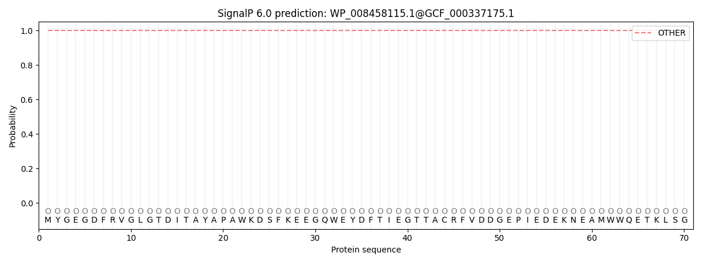 

 ***

#### WP_161605605.1@GCF_000337135.1

**Prediction:** Other

| Protein type   |   Other |   Signal Peptide (Sec/SPI) |   Lipoprotein signal peptide (Sec/SPII) |   TAT signal peptide (Tat/SPI) |   TAT Lipoprotein signal peptide (Tat/SPII) |   Pilin-like signal peptide (Sec/SPIII) |
|----------------|---------|----------------------------|-----------------------------------------|--------------------------------|---------------------------------------------|-----------------------------------------|
| Likelihood     |  0.9998 |                     0.0001 |                                       0 |                              0 |                                           0 |                                       0 |
**Download: ** [PNG](output_WP_161605605_1_GCF_000337135_1_plot.png) / [EPS](output_WP_161605605_1_GCF_000337135_1_plot.eps) /  [Tabular](output_WP_161605605_1_GCF_000337135_1_plot.txt)

 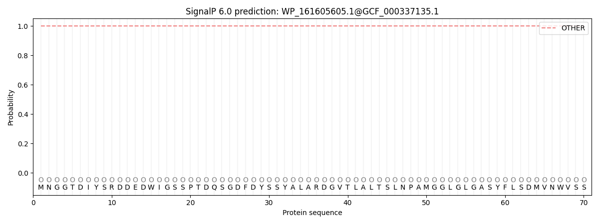 

 ***

#### WP_155396796.1@GCF_000970305.1

**Prediction:** Signal Peptide (Sec/SPI)

Cleavage site between pos. 30 and 31. Probability 0.972938

| Protein type   |   Other |   Signal Peptide (Sec/SPI) |   Lipoprotein signal peptide (Sec/SPII) |   TAT signal peptide (Tat/SPI) |   TAT Lipoprotein signal peptide (Tat/SPII) |   Pilin-like signal peptide (Sec/SPIII) |
|----------------|---------|----------------------------|-----------------------------------------|--------------------------------|---------------------------------------------|-----------------------------------------|
| Likelihood     |  0.0006 |                     0.9985 |                                  0.0003 |                         0.0002 |                                      0.0002 |                                  0.0002 |
**Download: ** [PNG](output_WP_155396796_1_GCF_000970305_1_plot.png) / [EPS](output_WP_155396796_1_GCF_000970305_1_plot.eps) /  [Tabular](output_WP_155396796_1_GCF_000970305_1_plot.txt)

 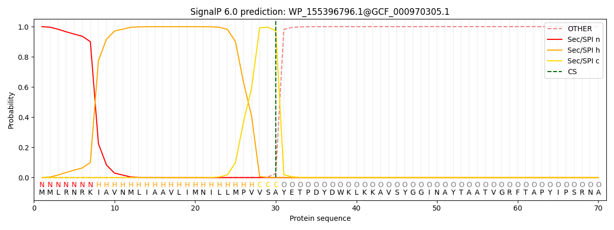 

 ***

#### WP_076157611.1@GCF_001955925.1

**Prediction:** Signal Peptide (Sec/SPI)

Cleavage site between pos. 30 and 31. Probability 0.975353

| Protein type   |   Other |   Signal Peptide (Sec/SPI) |   Lipoprotein signal peptide (Sec/SPII) |   TAT signal peptide (Tat/SPI) |   TAT Lipoprotein signal peptide (Tat/SPII) |   Pilin-like signal peptide (Sec/SPIII) |
|----------------|---------|----------------------------|-----------------------------------------|--------------------------------|---------------------------------------------|-----------------------------------------|
| Likelihood     |  0.0003 |                     0.9989 |                                  0.0002 |                         0.0002 |                                      0.0002 |                                  0.0002 |
**Download: ** [PNG](output_WP_076157611_1_GCF_001955925_1_plot.png) / [EPS](output_WP_076157611_1_GCF_001955925_1_plot.eps) /  [Tabular](output_WP_076157611_1_GCF_001955925_1_plot.txt)

 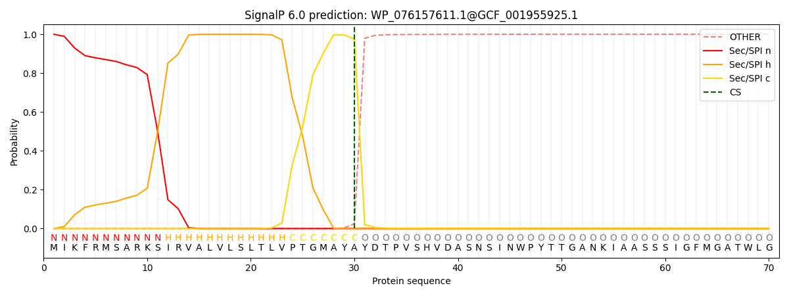 

 ***

#### WP_247730522.1@GCF_023093535.1

**Prediction:** TAT signal peptide (Tat/SPI)

Cleavage site between pos. 35 and 36. Probability 0.899930

| Protein type   |   Other |   Signal Peptide (Sec/SPI) |   Lipoprotein signal peptide (Sec/SPII) |   TAT signal peptide (Tat/SPI) |   TAT Lipoprotein signal peptide (Tat/SPII) |   Pilin-like signal peptide (Sec/SPIII) |
|----------------|---------|----------------------------|-----------------------------------------|--------------------------------|---------------------------------------------|-----------------------------------------|
| Likelihood     |       0 |                          0 |                                       0 |                              1 |                                           0 |                                       0 |
**Download: ** [PNG](output_WP_247730522_1_GCF_023093535_1_plot.png) / [EPS](output_WP_247730522_1_GCF_023093535_1_plot.eps) /  [Tabular](output_WP_247730522_1_GCF_023093535_1_plot.txt)

 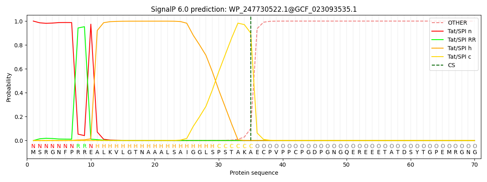 

 ***

#### JAGXOR010000056.1_11@GCA_023659785.1

**Prediction:** Signal Peptide (Sec/SPI)

Cleavage site between pos. 29 and 30. Probability 0.962770

| Protein type   |   Other |   Signal Peptide (Sec/SPI) |   Lipoprotein signal peptide (Sec/SPII) |   TAT signal peptide (Tat/SPI) |   TAT Lipoprotein signal peptide (Tat/SPII) |   Pilin-like signal peptide (Sec/SPIII) |
|----------------|---------|----------------------------|-----------------------------------------|--------------------------------|---------------------------------------------|-----------------------------------------|
| Likelihood     |  0.0113 |                     0.9855 |                                  0.0011 |                         0.0008 |                                      0.0006 |                                  0.0006 |
**Download: ** [PNG](output_JAGXOR010000056_1_11_GCA_023659785_1_plot.png) / [EPS](output_JAGXOR010000056_1_11_GCA_023659785_1_plot.eps) /  [Tabular](output_JAGXOR010000056_1_11_GCA_023659785_1_plot.txt)

 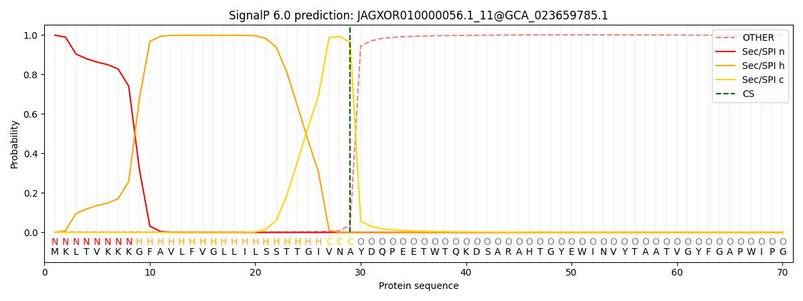 

 ***

#### WP_153552228.1@GCF_009617995.1

**Prediction:** TAT signal peptide (Tat/SPI)

Cleavage site between pos. 36 and 37. Probability 0.871776

| Protein type   |   Other |   Signal Peptide (Sec/SPI) |   Lipoprotein signal peptide (Sec/SPII) |   TAT signal peptide (Tat/SPI) |   TAT Lipoprotein signal peptide (Tat/SPII) |   Pilin-like signal peptide (Sec/SPIII) |
|----------------|---------|----------------------------|-----------------------------------------|--------------------------------|---------------------------------------------|-----------------------------------------|
| Likelihood     |       0 |                          0 |                                       0 |                         0.9765 |                                      0.0234 |                                       0 |
**Download: ** [PNG](output_WP_153552228_1_GCF_009617995_1_plot.png) / [EPS](output_WP_153552228_1_GCF_009617995_1_plot.eps) /  [Tabular](output_WP_153552228_1_GCF_009617995_1_plot.txt)

 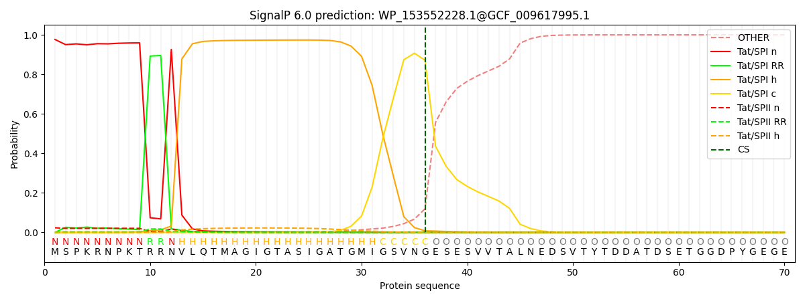 

 ***

#### JAEXCH010000014.1_14@GCA_023402275.1

**Prediction:** Other

| Protein type   |   Other |   Signal Peptide (Sec/SPI) |   Lipoprotein signal peptide (Sec/SPII) |   TAT signal peptide (Tat/SPI) |   TAT Lipoprotein signal peptide (Tat/SPII) |   Pilin-like signal peptide (Sec/SPIII) |
|----------------|---------|----------------------------|-----------------------------------------|--------------------------------|---------------------------------------------|-----------------------------------------|
| Likelihood     |  0.9715 |                     0.0282 |                                  0.0002 |                              0 |                                           0 |                                  0.0001 |
**Download: ** [PNG](output_JAEXCH010000014_1_14_GCA_023402275_1_plot.png) / [EPS](output_JAEXCH010000014_1_14_GCA_023402275_1_plot.eps) /  [Tabular](output_JAEXCH010000014_1_14_GCA_023402275_1_plot.txt)

 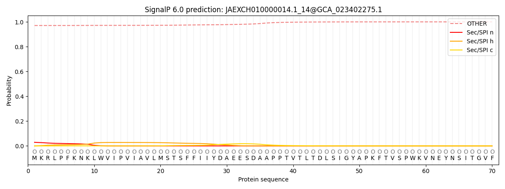 

 ***

#### WP_094227589.1@GCF_002243045.1

**Prediction:** Other

| Protein type   |   Other |   Signal Peptide (Sec/SPI) |   Lipoprotein signal peptide (Sec/SPII) |   TAT signal peptide (Tat/SPI) |   TAT Lipoprotein signal peptide (Tat/SPII) |   Pilin-like signal peptide (Sec/SPIII) |
|----------------|---------|----------------------------|-----------------------------------------|--------------------------------|---------------------------------------------|-----------------------------------------|
| Likelihood     |  1.0001 |                          0 |                                       0 |                              0 |                                           0 |                                       0 |
**Download: ** [PNG](output_WP_094227589_1_GCF_002243045_1_plot.png) / [EPS](output_WP_094227589_1_GCF_002243045_1_plot.eps) /  [Tabular](output_WP_094227589_1_GCF_002243045_1_plot.txt)

 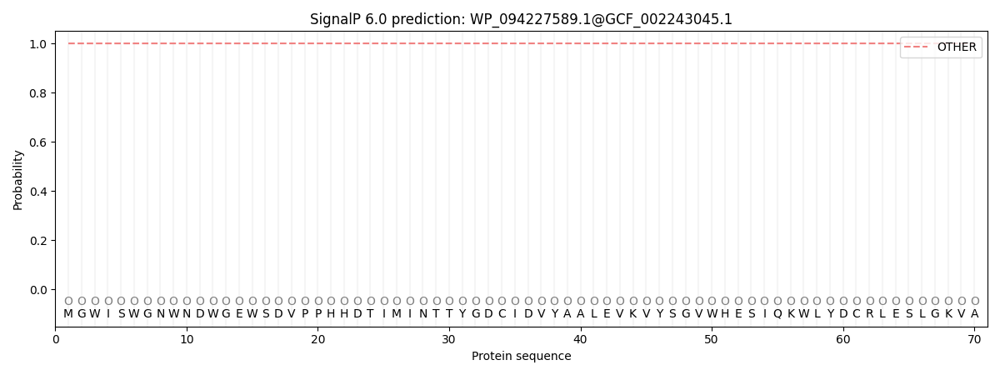 

 ***

#### PXF52170.1@GCA_003194435.1

**Prediction:** Other

| Protein type   |   Other |   Signal Peptide (Sec/SPI) |   Lipoprotein signal peptide (Sec/SPII) |   TAT signal peptide (Tat/SPI) |   TAT Lipoprotein signal peptide (Tat/SPII) |   Pilin-like signal peptide (Sec/SPIII) |
|----------------|---------|----------------------------|-----------------------------------------|--------------------------------|---------------------------------------------|-----------------------------------------|
| Likelihood     |  0.9999 |                     0.0001 |                                       0 |                              0 |                                           0 |                                  0.0001 |
**Download: ** [PNG](output_PXF52170_1_GCA_003194435_1_plot.png) / [EPS](output_PXF52170_1_GCA_003194435_1_plot.eps) /  [Tabular](output_PXF52170_1_GCA_003194435_1_plot.txt)

 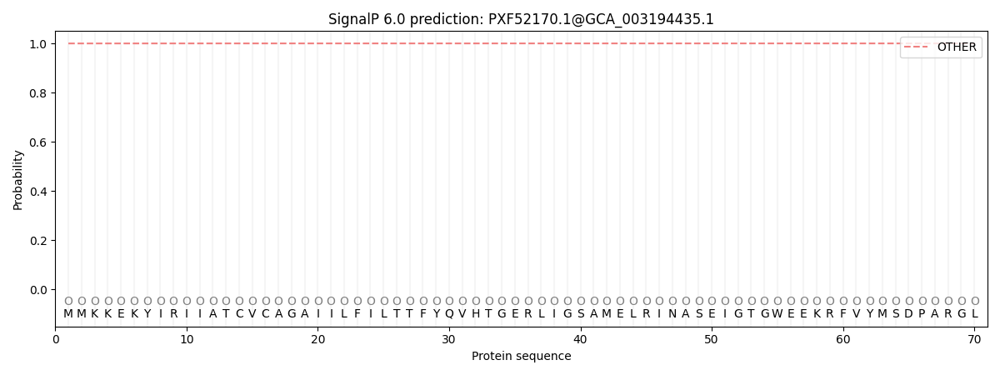 

 ***

#### QEXZ01000077.1_7@GCA_003160755.1

**Prediction:** Signal Peptide (Sec/SPI)

Cleavage site between pos. 29 and 30. Probability 0.976857

| Protein type   |   Other |   Signal Peptide (Sec/SPI) |   Lipoprotein signal peptide (Sec/SPII) |   TAT signal peptide (Tat/SPI) |   TAT Lipoprotein signal peptide (Tat/SPII) |   Pilin-like signal peptide (Sec/SPIII) |
|----------------|---------|----------------------------|-----------------------------------------|--------------------------------|---------------------------------------------|-----------------------------------------|
| Likelihood     |  0.0003 |                      0.999 |                                  0.0002 |                         0.0002 |                                      0.0002 |                                  0.0001 |
**Download: ** [PNG](output_QEXZ01000077_1_7_GCA_003160755_1_plot.png) / [EPS](output_QEXZ01000077_1_7_GCA_003160755_1_plot.eps) /  [Tabular](output_QEXZ01000077_1_7_GCA_003160755_1_plot.txt)

 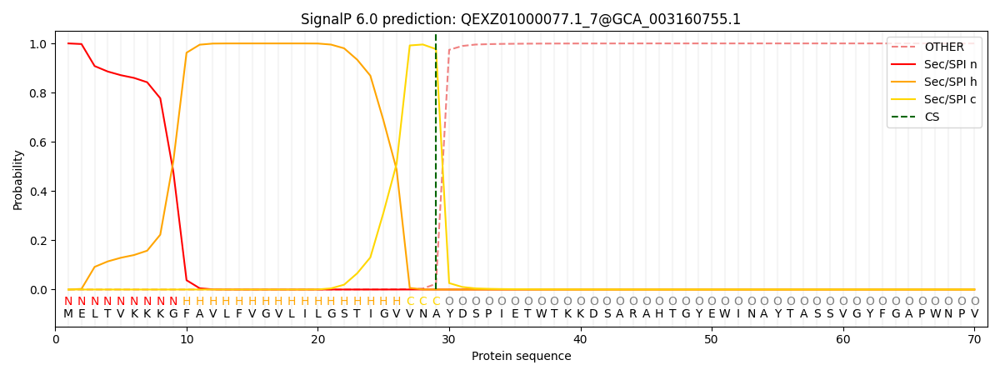 

 ***

#### WP_123067460.1@GCF_003719335.1

**Prediction:** Signal Peptide (Sec/SPI)

Cleavage site between pos. 33 and 34. Probability 0.962968

| Protein type   |   Other |   Signal Peptide (Sec/SPI) |   Lipoprotein signal peptide (Sec/SPII) |   TAT signal peptide (Tat/SPI) |   TAT Lipoprotein signal peptide (Tat/SPII) |   Pilin-like signal peptide (Sec/SPIII) |
|----------------|---------|----------------------------|-----------------------------------------|--------------------------------|---------------------------------------------|-----------------------------------------|
| Likelihood     |  0.0116 |                     0.9861 |                                  0.0006 |                         0.0007 |                                      0.0005 |                                  0.0005 |
**Download: ** [PNG](output_WP_123067460_1_GCF_003719335_1_plot.png) / [EPS](output_WP_123067460_1_GCF_003719335_1_plot.eps) /  [Tabular](output_WP_123067460_1_GCF_003719335_1_plot.txt)

 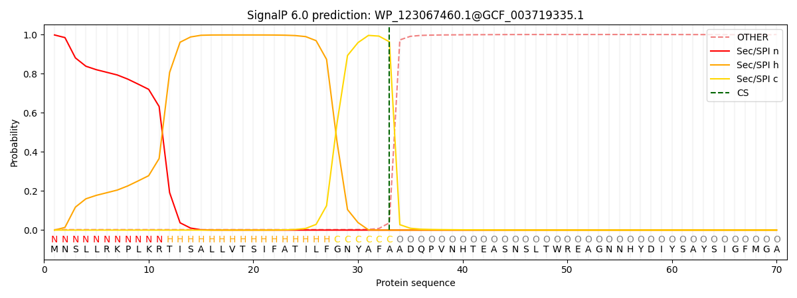 

 ***

#### NQE06396.1@GCA_013180605.1

**Prediction:** Signal Peptide (Sec/SPI)

Cleavage site between pos. 29 and 30. Probability 0.978080

| Protein type   |   Other |   Signal Peptide (Sec/SPI) |   Lipoprotein signal peptide (Sec/SPII) |   TAT signal peptide (Tat/SPI) |   TAT Lipoprotein signal peptide (Tat/SPII) |   Pilin-like signal peptide (Sec/SPIII) |
|----------------|---------|----------------------------|-----------------------------------------|--------------------------------|---------------------------------------------|-----------------------------------------|
| Likelihood     |  0.0003 |                     0.9991 |                                  0.0002 |                         0.0002 |                                      0.0002 |                                  0.0001 |
**Download: ** [PNG](output_NQE06396_1_GCA_013180605_1_plot.png) / [EPS](output_NQE06396_1_GCA_013180605_1_plot.eps) /  [Tabular](output_NQE06396_1_GCA_013180605_1_plot.txt)

 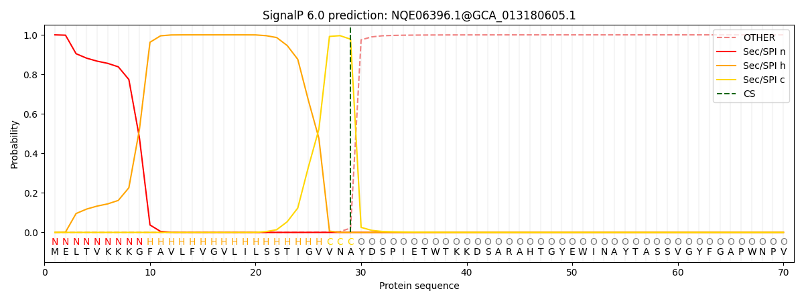 

 ***

#### WP_132280169.1@GCF_004339095.1

**Prediction:** Signal Peptide (Sec/SPI)

Cleavage site between pos. 32 and 33. Probability 0.962175

| Protein type   |   Other |   Signal Peptide (Sec/SPI) |   Lipoprotein signal peptide (Sec/SPII) |   TAT signal peptide (Tat/SPI) |   TAT Lipoprotein signal peptide (Tat/SPII) |   Pilin-like signal peptide (Sec/SPIII) |
|----------------|---------|----------------------------|-----------------------------------------|--------------------------------|---------------------------------------------|-----------------------------------------|
| Likelihood     |  0.0006 |                     0.9986 |                                  0.0002 |                         0.0002 |                                      0.0002 |                                  0.0002 |
**Download: ** [PNG](output_WP_132280169_1_GCF_004339095_1_plot.png) / [EPS](output_WP_132280169_1_GCF_004339095_1_plot.eps) /  [Tabular](output_WP_132280169_1_GCF_004339095_1_plot.txt)

 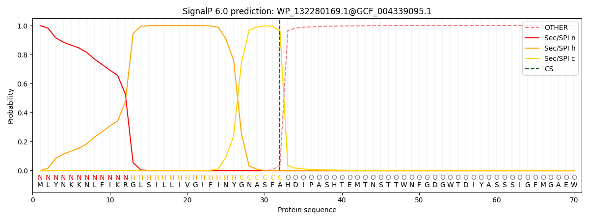 

 ***

#### WP_175383825.1@GCF_013359905.1

**Prediction:** Signal Peptide (Sec/SPI)

Cleavage site between pos. 33 and 34. Probability 0.959331

| Protein type   |   Other |   Signal Peptide (Sec/SPI) |   Lipoprotein signal peptide (Sec/SPII) |   TAT signal peptide (Tat/SPI) |   TAT Lipoprotein signal peptide (Tat/SPII) |   Pilin-like signal peptide (Sec/SPIII) |
|----------------|---------|----------------------------|-----------------------------------------|--------------------------------|---------------------------------------------|-----------------------------------------|
| Likelihood     |  0.0212 |                      0.976 |                                  0.0008 |                         0.0008 |                                      0.0006 |                                  0.0006 |
**Download: ** [PNG](output_WP_175383825_1_GCF_013359905_1_plot.png) / [EPS](output_WP_175383825_1_GCF_013359905_1_plot.eps) /  [Tabular](output_WP_175383825_1_GCF_013359905_1_plot.txt)

 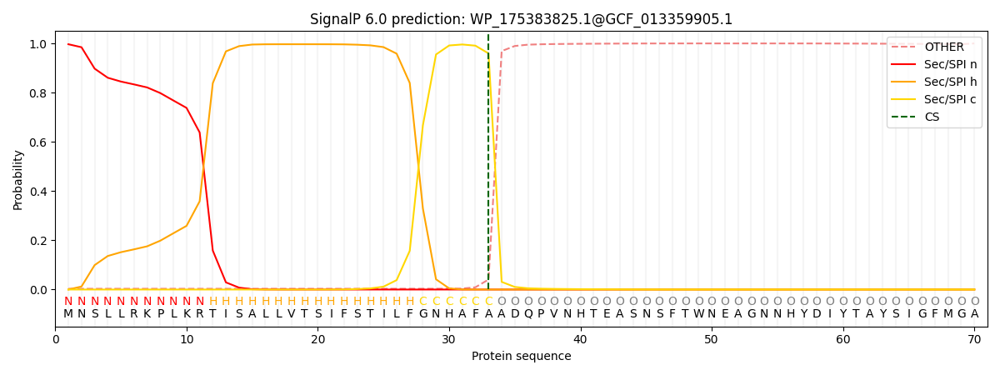 

 ***

#### WP_188202341.1@GCF_904067545.1

**Prediction:** Other

| Protein type   |   Other |   Signal Peptide (Sec/SPI) |   Lipoprotein signal peptide (Sec/SPII) |   TAT signal peptide (Tat/SPI) |   TAT Lipoprotein signal peptide (Tat/SPII) |   Pilin-like signal peptide (Sec/SPIII) |
|----------------|---------|----------------------------|-----------------------------------------|--------------------------------|---------------------------------------------|-----------------------------------------|
| Likelihood     |  0.9984 |                     0.0017 |                                       0 |                              0 |                                           0 |                                       0 |
**Download: ** [PNG](output_WP_188202341_1_GCF_904067545_1_plot.png) / [EPS](output_WP_188202341_1_GCF_904067545_1_plot.eps) /  [Tabular](output_WP_188202341_1_GCF_904067545_1_plot.txt)

 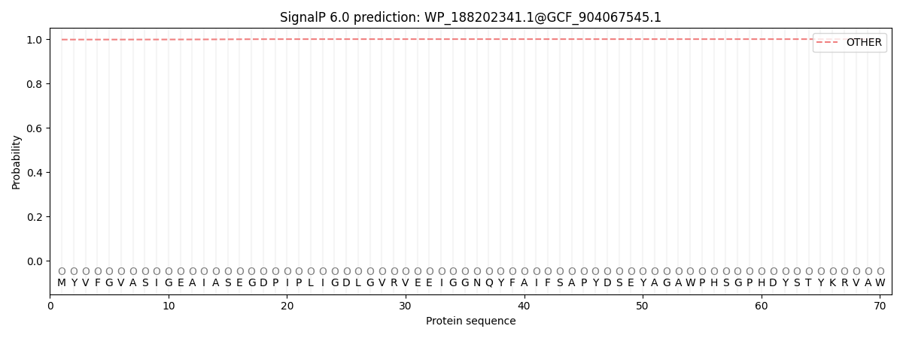 

 ***

#### WP_220681389.1@GCF_019633745.1

**Prediction:** Other

| Protein type   |   Other |   Signal Peptide (Sec/SPI) |   Lipoprotein signal peptide (Sec/SPII) |   TAT signal peptide (Tat/SPI) |   TAT Lipoprotein signal peptide (Tat/SPII) |   Pilin-like signal peptide (Sec/SPIII) |
|----------------|---------|----------------------------|-----------------------------------------|--------------------------------|---------------------------------------------|-----------------------------------------|
| Likelihood     |       1 |                          0 |                                       0 |                              0 |                                           0 |                                       0 |
**Download: ** [PNG](output_WP_220681389_1_GCF_019633745_1_plot.png) / [EPS](output_WP_220681389_1_GCF_019633745_1_plot.eps) /  [Tabular](output_WP_220681389_1_GCF_019633745_1_plot.txt)

 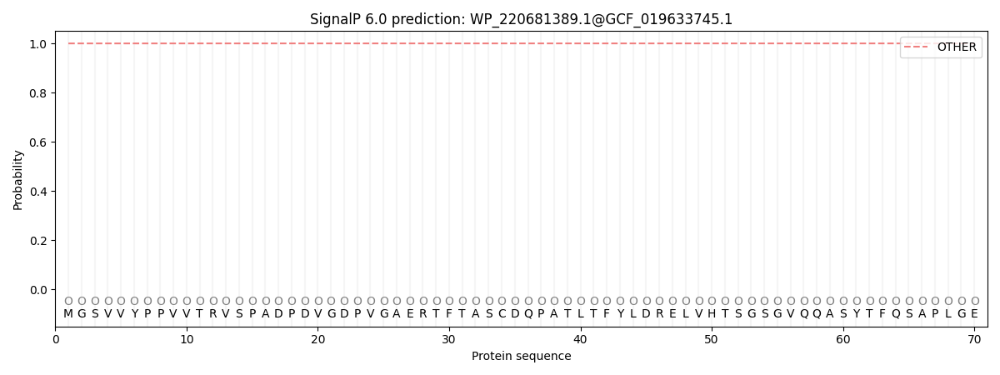 

 ***

#### MTLP01000007.1_117@GCA_002009975.1

**Prediction:** Signal Peptide (Sec/SPI)

Cleavage site between pos. 25 and 26. Probability 0.968760

| Protein type   |   Other |   Signal Peptide (Sec/SPI) |   Lipoprotein signal peptide (Sec/SPII) |   TAT signal peptide (Tat/SPI) |   TAT Lipoprotein signal peptide (Tat/SPII) |   Pilin-like signal peptide (Sec/SPIII) |
|----------------|---------|----------------------------|-----------------------------------------|--------------------------------|---------------------------------------------|-----------------------------------------|
| Likelihood     |  0.0007 |                      0.998 |                                  0.0004 |                         0.0003 |                                      0.0003 |                                  0.0003 |
**Download: ** [PNG](output_MTLP01000007_1_117_GCA_002009975_1_plot.png) / [EPS](output_MTLP01000007_1_117_GCA_002009975_1_plot.eps) /  [Tabular](output_MTLP01000007_1_117_GCA_002009975_1_plot.txt)

 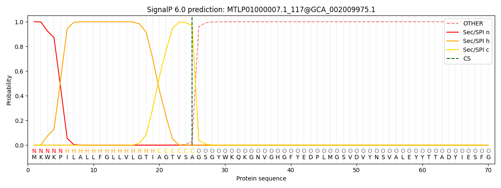 

 ***

#### CALUHR010000006.1_67@GCA_944320495.1

**Prediction:** Signal Peptide (Sec/SPI)

Cleavage site between pos. 27 and 28. Probability 0.957839

| Protein type   |   Other |   Signal Peptide (Sec/SPI) |   Lipoprotein signal peptide (Sec/SPII) |   TAT signal peptide (Tat/SPI) |   TAT Lipoprotein signal peptide (Tat/SPII) |   Pilin-like signal peptide (Sec/SPIII) |
|----------------|---------|----------------------------|-----------------------------------------|--------------------------------|---------------------------------------------|-----------------------------------------|
| Likelihood     |  0.0002 |                     0.9992 |                                  0.0001 |                         0.0002 |                                      0.0001 |                                  0.0001 |
**Download: ** [PNG](output_CALUHR010000006_1_67_GCA_944320495_1_plot.png) / [EPS](output_CALUHR010000006_1_67_GCA_944320495_1_plot.eps) /  [Tabular](output_CALUHR010000006_1_67_GCA_944320495_1_plot.txt)

 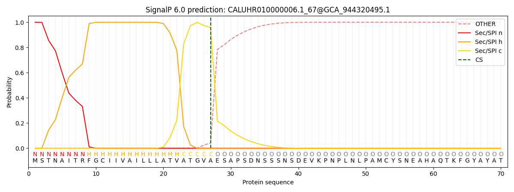 

 ***

#### WP_167895259.1@GCF_012027355.1

**Prediction:** Signal Peptide (Sec/SPI)

Cleavage site between pos. 25 and 26. Probability 0.966693

| Protein type   |   Other |   Signal Peptide (Sec/SPI) |   Lipoprotein signal peptide (Sec/SPII) |   TAT signal peptide (Tat/SPI) |   TAT Lipoprotein signal peptide (Tat/SPII) |   Pilin-like signal peptide (Sec/SPIII) |
|----------------|---------|----------------------------|-----------------------------------------|--------------------------------|---------------------------------------------|-----------------------------------------|
| Likelihood     |  0.0006 |                     0.9984 |                                  0.0002 |                         0.0003 |                                      0.0003 |                                  0.0002 |
**Download: ** [PNG](output_WP_167895259_1_GCF_012027355_1_plot.png) / [EPS](output_WP_167895259_1_GCF_012027355_1_plot.eps) /  [Tabular](output_WP_167895259_1_GCF_012027355_1_plot.txt)

 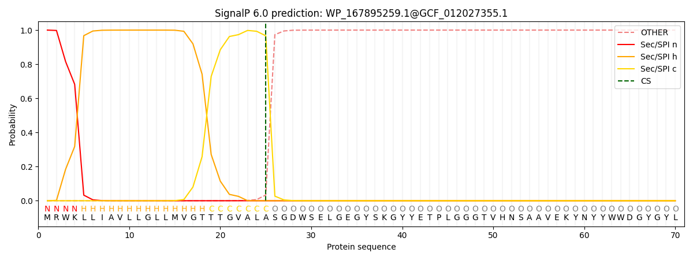 

 ***

